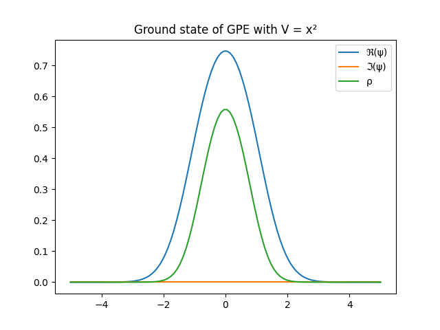
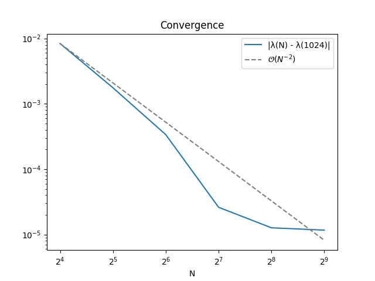

Solving https://matmat.org/jobs/problem/

# Setup

Install packages:
``` sh
python3.12 -m pip install -r requirements.txt  # lower versions of python might work as well
```

Run tests:

``` sh
python3.12 -m pytest
```

# Implementation

The `GrossPitaevksiiSolver` in `gpe/solver.py` solves the Gross-Pitaevskii equation using the
SCF procedure from the problem description. It does so using `Hamiltonian` and `WaveFunction` objects,
which represent the problem in real space. The kinetic energy is computed with a straighforward central
difference approximation, the potential and the boson-boson coupling are element-wise multiplications with
the discretized wave function. The eigenvalue problem at each step is solved by
[`scipy.sparse.linalg.eigsh`](https://docs.scipy.org/doc/scipy/reference/generated/scipy.sparse.linalg.eigsh.html),
which wraps an Lanczos-type algorithm from ARPACK.

## Extensions

Currently, the Laplace operator in the kinetic energy term is implemented as a sparse matrix-vector
multiplication, an operation with time-complexity $\mathcal{O}(N)$ (citation needed), where $N$ is
the system size (and crucially the number of nonzero terms in the matrix). Also it has a truncation
error of $\mathcal{O}(\Delta x^2) = \mathcal{O}(N^{-2})$. This means the work to reduce the error scales
as $\mathcal{O}(N^3)$.
Of course this is only the first step in analyzing the algorithm, since the iterative eigensolver and the
SCF procedure are built on top of this.

In contrast, transforming the wavefunction into momentum-space via FFT costs $\mathcal{O}(\log N)$, and
allows us to compute the kinetic energy as a simple element-wise multiplication. Since
the boson-boson interaction still has to be applied in real space, the wavefunction has
to be transformed back.

I don't know:
- Does using the FFT as described allow us to diagonalize $H$ in a more efficient way than the iterative eigensolver used currently?
- What is the discretization error associated with applying the kinetic operator in Fourier space?
- What are the effects of implementing this strategy in code,
  e.g. how explicitly the plane waves are present in the implementation (are they just implicitly multplied
  with the coefficients in the Fourier basis, or do they show up explicitly somewhere), 
  and how is this related to the Hamiltonian blocks $H_k$ described in the
  [DFTK docs](https://docs.dftk.org/stable/guide/periodic_problems/#Discretization-and-plane-wave-basis-sets).

# Reproduce DFTK GPE Example

`python3.12 reproduce_DFTK_GPE.py` computes the solution to the GPE with $V(x) = x^2$.

Visually, the resulting $\psi$ and $\rho$ match the expected solution from the [DFTK GPE example](https://docs.dftk.org/stable/examples/gross_pitaevskii/):



Similarly, the energy contribution of the kinetic and potential term match (up to expected
discretization errors). However, the energy of the boson-boson interaction is off by a factor of 2.
This is independent of the grid spacing and the cutoff-distance (provided it is large enough to ignore
the boundary conditions).

| $[Ha]$ | My Solution | DFTK |
|--|-------------|------|
| $\bra{\psi}H\ket{\psi}$ | 1.5490696  |  1.1440368  |
| $\bra{\psi}K\ket{\psi}$ | 0.2680410  |  0.2682057  |
| $\bra{\psi}V\ket{\psi}$ | 0.4704457  |  0.4707475  |
| $\bra{\psi}(2C\rho)\ket{\psi}$ | 0.8105828  | 0.4050836  |

# Convergence

See below the error of the resulting ground state energy of the GPE with parabolic potential (same as above), i.e. $|\lambda_{[N]} - \lambda_{ref}|$,
where $\lambda_{[N]}$ is computed on a grid with $N$ points and $\lambda_{ref}$
is the reference solution computed on grid with 1024 gridpoints.



From the discretization error of the kinetic error we expect a convergence rate of $\mathcal{O}(N^{-2})$. The deviations of the observed error from this scaling can be attributed to the
iterative eigensolver and the SCF procedure.

# Task 2: Two-Gaussian Potential

TODO
